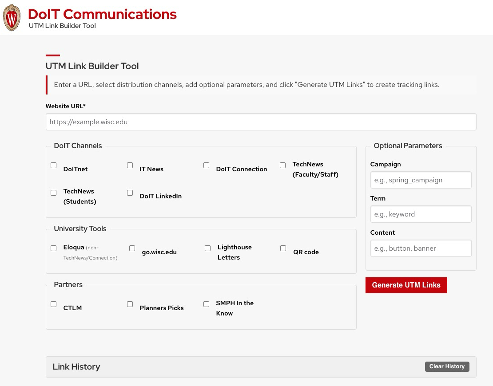

# DoIT Communications UTM Link Builder

A simple, accessible web tool for creating UTM-tagged links for communication channels at UW-Madison's Department of Information Technology (DoIT).

## Features

- Generate UTM-tagged URLs for various DoIT and university communication channels
- Predefined source and medium parameters for each channel
- Support for optional campaign, term, and content parameters
- Link history tracking to review and reuse previously created links
- Clean, responsive interface that works on all devices
- Accessibility features for keyboard navigation and screen readers
- Copy functionality for individual URLs or all generated URLs at once
- Handles existing UTM parameters by automatically removing them
- Works offline - no server or internet connection required

## Usage

1. Enter the destination URL you want to track
2. Select the communication channel(s) where the link will be shared
3. (Optional) Add campaign, term, or content parameters
4. Click "Generate UTM Links" to create your tracking URLs
5. Copy links individually or use "Copy All URLs" to get all at once
6. View previously generated links in the Link History section

## UTM Parameter Format

The tool automatically formats UTM parameters according to best practices:
- All parameters are converted to lowercase
- Spaces are replaced with underscores
- Only alphanumeric characters, underscores, and hyphens are allowed
- Multiple underscores are condensed to a single underscore
- Leading and trailing underscores are removed

## Communication Channels

The tool supports the following communication channels:

### DoIT Channels
- DoITnet (utm_medium=referral)
- IT News (utm_medium=referral)
- DoIT Connection (utm_medium=email)
- TechNews Faculty/Staff (utm_medium=email)
- TechNews Students (utm_medium=email)
- DoIT LinkedIn (utm_medium=social)

### University Tools
- Eloqua (utm_medium=email)
- go.wisc.edu (utm_medium=referral)
- Lighthouse Letters (utm_medium=email)
- QR code (utm_medium=referral)

### Partners
- CTLM (utm_medium=referral)
- Planners Picks (utm_medium=email)
- SMPH In the Know (utm_medium=email)

## Installation

This is a completely client-side application that can be run locally:

1. Download the `utm-tool.html` file
2. Open it in any modern web browser
3. No server, installation or internet connection required

You can also host it on any web server or GitHub Pages for team access.

## Browser Compatibility

The tool works in all modern browsers:
- Chrome, Firefox, Safari, Edge (latest versions)
- Mobile browsers on iOS and Android
- Internet Explorer 11 (with fallback copy functionality)

## Link History

The tool includes a link history feature that:

- Automatically saves all generated UTM links
- Stores details including base URL, campaign, term, and content parameters
- Displays links with timestamps showing when they were created
- Allows copying of previously created links directly from the history
- Persists between browser sessions using localStorage
- Provides option to clear history when needed
- Limits storage to the 50 most recent link sets

## Development

To modify or extend the tool:

- The entire application is contained in a single HTML file
- CSS styles are in the `<style>` section at the top
- JavaScript code is in the `<script>` section at the bottom
- No build process or dependencies required

## License

[MIT License](LICENSE)

## Credits

Created by DoIT Communications at UW-Madison.